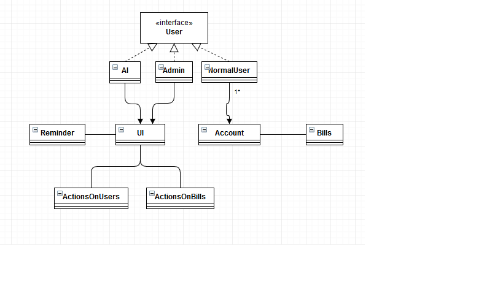
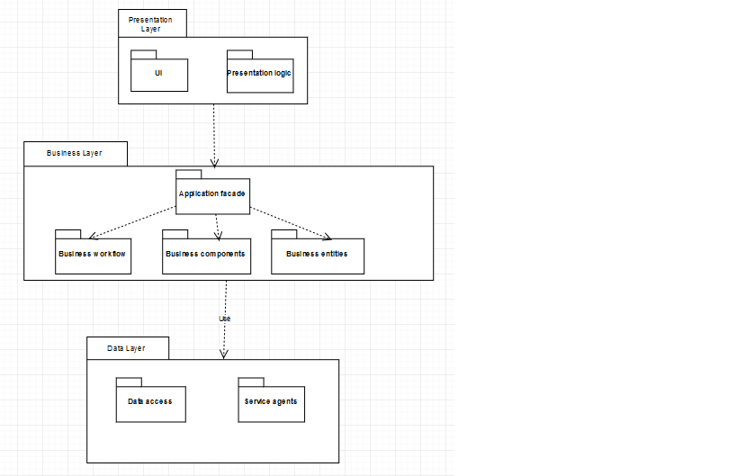
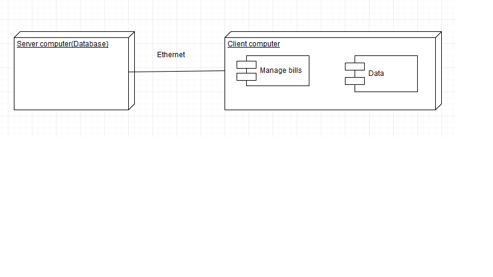
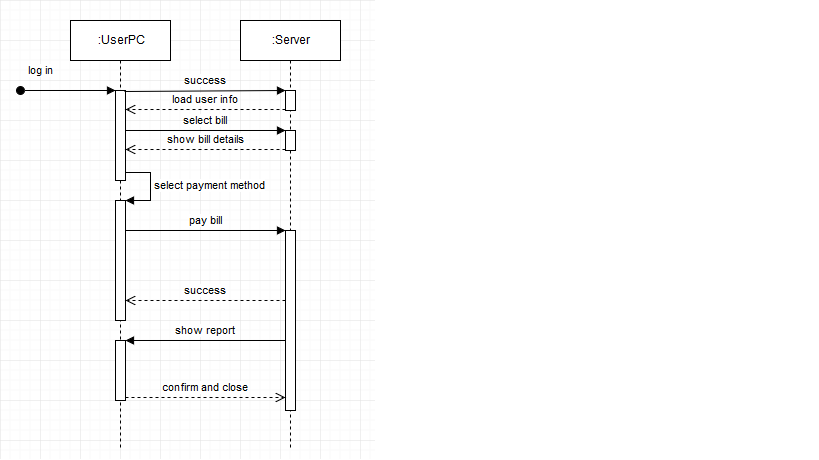
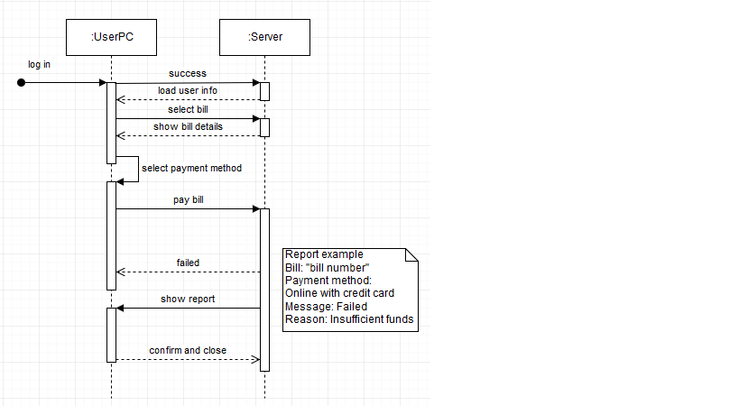

# Bills manager Specification

Bills manager is an application that allows users to manage their bills, whether they are facility bills or not.

# Elaboration – Iteration 1.1

## Domain Model

Bills manager is an application that solves to problem of staying in queues to pay different types of bills, by allowing you to pay and manage them from home in a few minutes.

## Architectural Design

### Conceptual Architecture

BM app uses the layered architectural style combined with client/server architectural style because it needs to allow multiple clients to access the server(database) and the usage of different layers helps to support a strong separation of concerns that,in turn, supports flexibility and maintainability.

### Package Design

### Component and Deployment Diagrams

# Elaboration – Iteration 1.2

## Design Model

### Dynamic Behavior
[Create the interaction diagrams (1 sequence, 1 communication diagrams) for 2 relevant scenarios]

First sequence diagram shows a successful scenario where an user selects a bill, see its details, select the payment method and pays it.

The second sequence diagram shows an unsuccessful attempt to pay a bill.

### Class Design
[Create the UML class diagram; apply GoF patterns and motivate your choice]

### Data Model
[Create the data model for the system.]

### Unit Testing
[Present the used testing methods and the associated test case scenarios.]

# Elaboration – Iteration 2

## Architectural Design Refinement
[Refine the architectural design: conceptual architecture, package design (consider package design principles), component and deployment diagrams. Motivate the changes that have been made.]

## Design Model Refinement
[Refine the UML class diagram by applying class design principles and GRASP; motivate your choices. Deliver the updated class diagrams.]

# Construction and Transition

## System Testing
[Describe how you applied integration testing and present the associated test case scenarios.]

## Future improvements
[Present future improvements for the system]

# Bibliography
- [Architectural Styles](https://docs.microsoft.com/en-us/azure/architecture/guide/architecture-styles/)
- [Architectural Patterns and Styles](https://msdn.microsoft.com/en-us/library/ee658117.aspx)
- [Online diagram drawing software](https://yuml.me/) ([Samples](https://yuml.me/diagram/scruffy/class/samples))
- [Yet another online diagram drawing software](https://www.draw.io)
