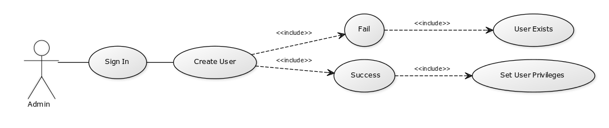
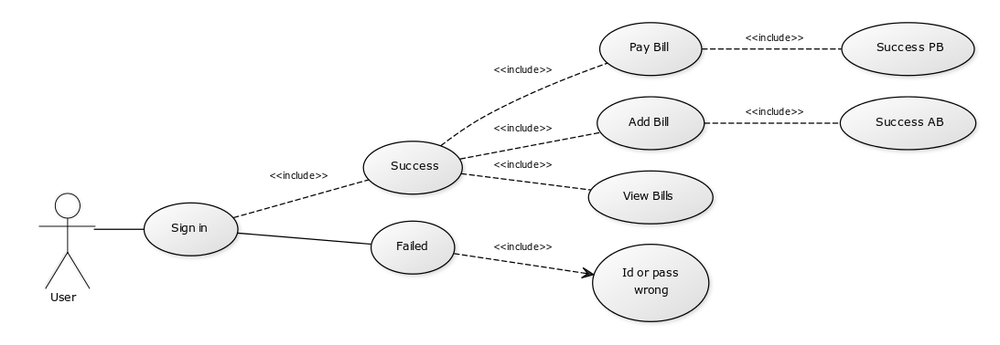
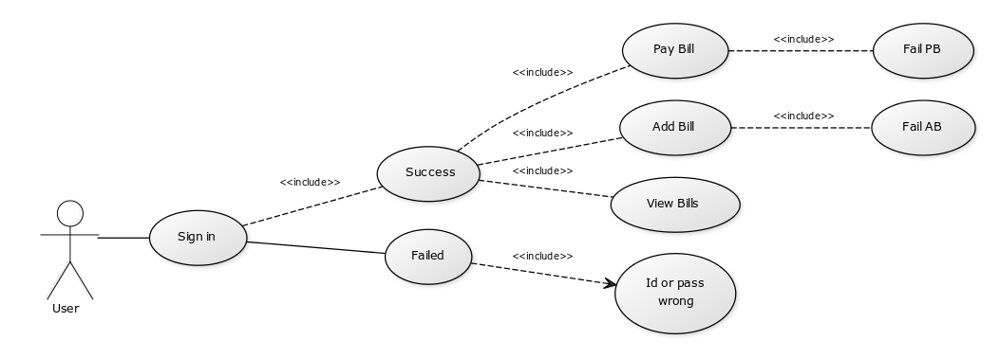

# (Bills Manager) Use Case Model

# Use-Cases Identification
[Identify actors, scenarios and use cases. Describe the three most important use-cases according to the following format:

## Use case 1
* **Use case**: creating an user by admin
* **Level**: user action
* **Primary actor**: Admin
* **Main success scenario**: admin enters an user id and password if the user already exists, will fail and appear a message on screen, if there is no user with that id, then it will be created
* **Extensions**: a password must be choose for every single user,it has some standards for example minimum 8 characters, if the requirements are not accomplished, new user creation will fail.

## Use case 2
* **Use case**: user log in and performing an action
* **Level**: logging in, viewing bills, paying bills, adding bills
* **Primary actor**: User
* **Main success scenario**: user log in, view bills, pay bill, success.
* **Extensions**: user log in failed, or
user log in succeeded, viewing bills, paying bill : fail, not enough money on credit card.
## Use case 3
* **Use case**: use case goal
* **Level**: one of: summary level, user-goal level, sub-function
* **Primary actor**: a role name for the actor who initiates the use case>
* **Main success scenario**: the steps of the main success scenario from trigger to goal delivery
* **Extensions**: alternate scenarios of success or failure

## Use case 4
* **Use case**: use case goal
* **Level**: one of: summary level, user-goal level, sub-function
* **Primary actor**: a role name for the actor who initiates the use case>
* **Main success scenario**: the steps of the main success scenario from trigger to goal delivery
* **Extensions**: alternate scenarios of success or failure

# UML Use-Case Diagrams
[Create the UML Use-Case Diagrams.]

## Diagram 1

## Diagram 2

## Diagram 3

<!---
## Diagram 4  

-->

# Bibliography

* [Online diagram drawing software](https://yuml.me/) ([Samples](https://yuml.me/diagram/nofunky/usecase/samples))
* [Yet another online diagram drawing software](https://www.draw.io)
